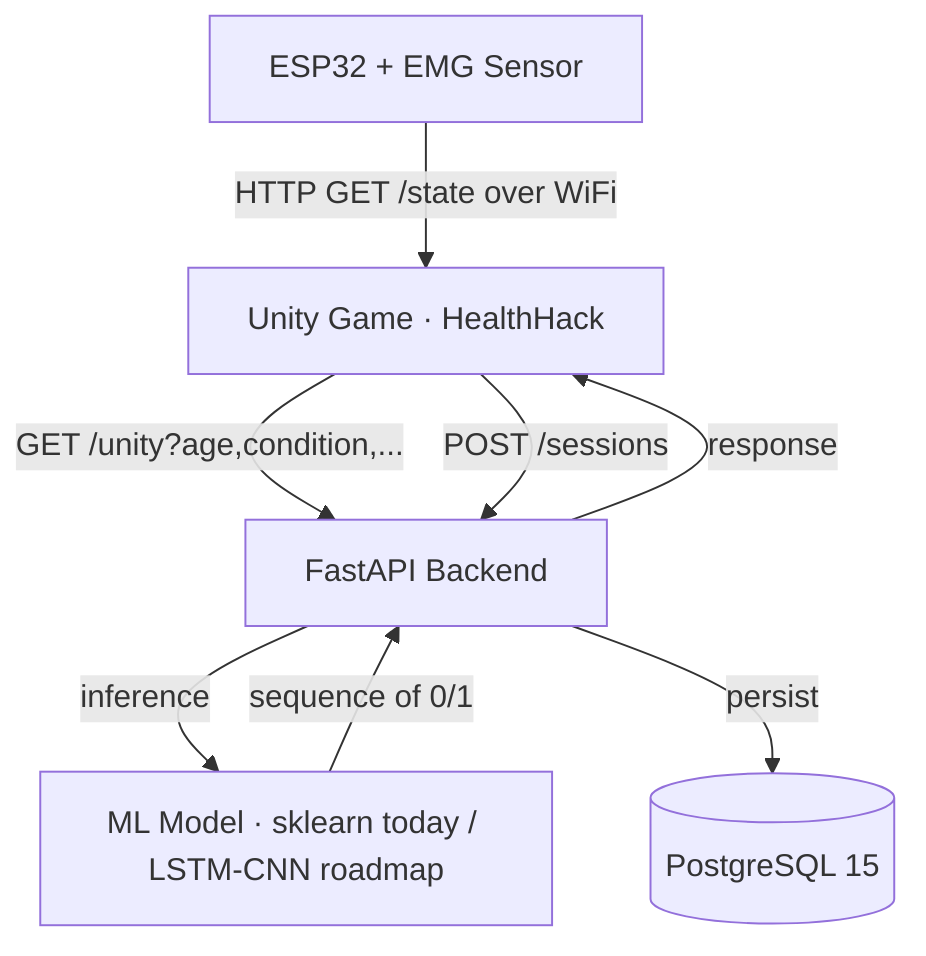

## 🎥 Demo

---
https://github.com/user-attachments/assets/bf343186-ccd5-4f9d-a683-a75dccbdc9ef
---
<div align="center">

# 🎮 HOLD IT — GAME4HEALTH

**EMG-based serious game for upper limb motor rehabilitation with AI**


</div>

---

## 📋 Overview

**HOLD IT — GAME4HEALTH** is a clinical-grade serious game that turns upper-limb
electromyography (EMG) signals into a real-time gameplay loop. A patient wearing
a wireless EMG armband fires the in-game cannon by *holding* a muscle contraction
for a target duration. The game adapts the contraction sequence to the patient's
condition (Parkinson's, post-stroke, atrophy, sports injury, healthy baseline)
and severity, providing motivating, measurable rehabilitation at home or in clinic.

**Problem.** Conventional motor rehab is repetitive, hard to dose correctly,
and patients drop out. Therapists have no objective signal of effort between
visits.

**Our approach.** Cheap ESP32 + EMG hardware streams raw signal to a FastAPI
backend that drives an adaptive Unity game and persists every session for the
clinician.

**Target users.** Physiotherapists, rehab clinics, and post-discharge patients
with measurable EMG output in the targeted limb.

---

## 🏗️ Architecture



The ESP32 currently exposes a WiFi HTTP endpoint (`/state`) that the Unity
client polls. A USB-serial fallback is wired into the docker-compose (commented
out) and will activate once the firmware switches transports.

---

## 🔧 Hardware Requirements

| Component | Model | Purpose |
|---|---|---|
| MCU | ESP32-WROOM-32 | WiFi-capable acquisition + HTTP server |
| Biosignal sensor | EMG analog front-end (e.g. MyoWare 2.0 / Olimex EMG) | Surface EMG capture |
| Electrodes | 3× Ag/AgCl disposable | Skin contact (REF + 2 active) |
| Power | USB-C 5V, 500 mA | Powers the ESP32 |
| Host | Linux/Windows PC, GPU optional | Runs Unity build + Docker stack |

---

## 🚀 Getting Started

### Prerequisites
- Docker & Docker Compose v2
- Git ≥ 2.30
- Unity 6000.3.5f2 (only required to rebuild the game)

### Clone with submodules

```bash
git clone --recurse-submodules https://github.com/killpathic/holdit-game4health.git
cd holdit-game4health
```

### Configure environment

```bash
cp .env.example .env
# edit .env and set DB_USER, DB_PASSWORD, DATABASE_URL, SECRET_KEY
```

### Bring up the stack

```bash
docker compose up --build
```

The API is now reachable at `http://localhost:8000` and the database at
`localhost:5432`.

### Run the game

Open `HealthHack/EmgProject/` in Unity 6000.3.5f2 and press *Play*, or build a
standalone executable and launch it. The game points at `http://localhost:8000`
out of the box.

---

## 📁 Project Structure

```
holdit-game4health/
├── HealthHack/               # ⛔ Existing Unity 6 game + reference Python service — DO NOT MODIFY
│   ├── EmgProject/           #     Unity project (scripts in Assets/Scripts/)
│   └── HealthHack/           #     Original FastAPI prototype + sklearn model artifacts
├── api/                      # New FastAPI backend (containerized)
│   ├── Dockerfile
│   ├── main.py
│   └── requirements.txt
├── ml/                       # Future home of the LSTM/CNN calibration layer
├── firmware/                 # ESP32 firmware (git submodule)
├── docs/                     # Clinical + technical documentation
├── assets/                   # README visuals (demo.gif, architecture.gif)
├── docker-compose.yml
├── .env.example              # Safe template — committed
├── .env                      # Real secrets — gitignored
├── .gitignore
└── README.md
```

---

## 📡 API Reference

| Method | Endpoint | Description |
|---|---|---|
| `GET` | `/health` | Liveness probe — returns `{"status": "ok"}` |
| `GET` | `/unity` | Returns an adapted 0/1 contraction sequence given `age`, `condition`, `status`, `max_duration` |
| `POST` | `/sessions` | Persist a completed rehab session (sequence + patient metadata) |
| `GET` | `/sessions/{id}` | Retrieve a stored session |

Interactive docs at `http://localhost:8000/docs` once the stack is running.

---

## 🔌 Firmware

The ESP32 firmware lives in its own repository and is linked here as a git
submodule under `firmware/`:

- **Repo:** https://github.com/killpathic/firmware-esp32
- **Update locally:** `git submodule update --remote firmware`
- **Pin a new commit:** edit `firmware/`, then `git add firmware && git commit`

---

## 🗺️ Roadmap

- [x] ESP32 EMG signal capture
- [x] Unity game (HealthHack)
- [x] FastAPI backend + PostgreSQL persistence
- [ ] LSTM/CNN calibration layer (replaces the current sklearn baseline)
- [ ] Patient & clinician dashboard
- [ ] Clinical trial — Rabat pilot
- [ ] MENA expansion

---

## 📄 License

Private — All rights reserved © 2026 Walid
